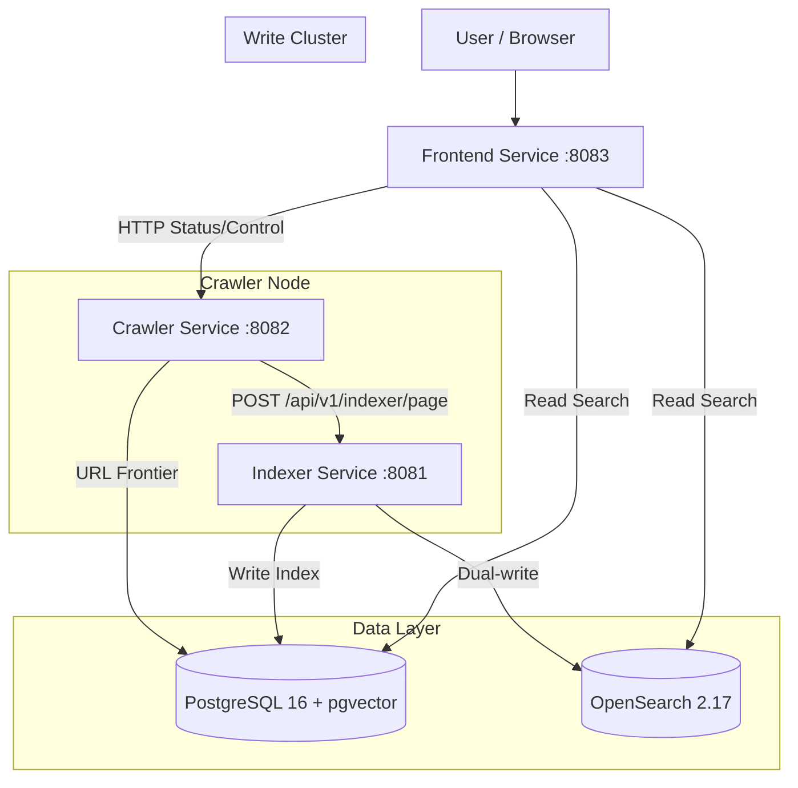

# Architecture Overview

The `web-search` project follows a **Service-Based Architecture** designed for clear separation of concerns, scalability, and independent deployment of Read/Write workloads (CQRS-lite).

## High-Level Design

The system consists of three independent services managed in a monorepo:

1.  **Frontend Service (Search Cluster)**:
    -   **Role**: UI, Search API (Read-Only), Admin Dashboard (Crawler Control, Analytics, API Keys).
    -   **Stack**: FastAPI + Jinja2 + PostgreSQL.
    -   **Port**: `8083`.
    -   **Scaling**: Can scale horizontally; shared DB in production.
    -   **Dependencies**: Depends on `shared` for DB models, search kernel, analyzer.
2.  **Indexer Service (Write Cluster)**:
    -   **Role**: Ingestion, Tokenization (Japanese via SudachiPy), Embedding (OpenAI), Dual-write to OpenSearch.
    -   **Stack**: FastAPI + PostgreSQL + SudachiPy + OpenSearch (optional).
    -   **Port**: `8081`.
    -   **Scaling**: Write-heavy service; decoupled from read load.
    -   **Async Worker**: Background job processor for tokenization and embedding generation.
3.  **Crawler Service (Worker Node)**:
    -   **Role**: URL frontier management, parallel fetching, content extraction, link discovery.
    -   **Stack**: FastAPI + PostgreSQL + aiohttp + trafilatura (BS4 fallback).
    -   **Port**: `8082`.
    -   **Communication**: Sends pages to Indexer via HTTP API.



## Directory Structure

The project uses a **Folder-Separated Monorepo** pattern:

| Directory | Package Name | Purpose | Key Components |
| :--- | :--- | :--- | :--- |
| `frontend/` | `frontend` | **Search Cluster**. UI & Search Logic. | `api/routers/search_api.py`, `services/search.py` |
| `indexer/` | `app` | **Write Cluster**. Indexing & Embedding. | `api/routes/indexer.py`, `services/indexer.py`, `worker.py` |
| `crawler/` | `app` | **Worker Node**. Fetching & URL Management. | `workers/pipeline.py`, `db/url_store.py`, `scheduler.py` |
| `shared/` | `shared` | **Shared Kernel**. Domain Logic & Infra. | `postgres/search.py`, `search_kernel/analyzer.py`, `search_kernel/searcher.py` |
| `db/alembic/` | - | **Database Migrations**. | `versions/001_initial_schema.py` ... `versions/007_optimize_urls_hot_updates.py` |
| `docs/` | - | **Documentation**. | `architecture.md`, `setup.md`, `api.md` |
| `scripts/ops/` | - | **Operations**. | PageRank calculation, seed import, OpenSearch verify |

## Key Design Patterns

### 1. CQRS-lite (Separated Read/Write)
We separate the "Write" path (Indexer) from the "Read" path (Frontend).
*   **Indexer**: Heavy processing (Tokenization, Embedding Generation, OpenSearch sync).
*   **Frontend**: Fast reads via PostgreSQL BM25 or OpenSearch.
*   Both services share the same PostgreSQL database.

### 2. URL Lifecycle (Unified `urls` Table)
The crawler manages URLs in a single `urls` table with status transitions:

```
pending → crawling → done
                  → failed
          → pending (retry)
```

**Database indexes** are designed for HOT (Heap Only Tuple) updates:
*   `idx_urls_pending_claim(status, priority DESC, created_at) WHERE status = 'pending'`
*   `idx_urls_pending_domain(domain) WHERE status = 'pending'`
*   `idx_urls_domain(domain)`

The `crawling → done` transition has zero index operations, enabling PostgreSQL HOT updates with `fillfactor=70`.

### 3. Shared Library (`shared/`)
*   **Database**: PostgreSQL 16 with pgvector extension. Connection pooling via `psycopg2.pool.ThreadedConnectionPool`.
*   **Search Engine (`shared.search_kernel`)**:
    *   **Hybrid Search**: Combines BM25 (Keyword) and Vector (Semantic) scores using Reciprocal Rank Fusion (RRF).
    *   **Tokenizer**: `SudachiPy` for Japanese morphological analysis.
    *   **Scoring**: BM25 + PageRank boosting + Content quality boosting + Title boosting + Domain diversity.
    *   **Snippet Generation**: Context-aware snippet extraction with `<mark>` highlighting.
*   **OpenSearch Integration** (`shared.opensearch`): Optional dual-write for fast full-text search.

### 4. Content Quality Pipeline
The system uses a 3-layer quality stack (see [content-quality.md](./content-quality.md)):
1.  **Extraction**: trafilatura strips boilerplate (nav, footer, sidebar), BS4 fallback for edge cases.
2.  **Quality Score**: Indexer computes `content_quality` (0.0-1.0) from word count, link density, and structure signals.
3.  **Ranking**: OpenSearch `function_score` boosts high-quality pages via `content_quality` field.

### 5. Data Flow
1.  **Crawl**: Crawler fetches HTML, extracts main content via trafilatura, extracts links/`published_at`, sends to Indexer via HTTP API.
2.  **Index**: Indexer tokenizes text (SudachiPy), computes content quality, generates embeddings (OpenAI), writes to PostgreSQL + OpenSearch.
3.  **Search**: Frontend queries PostgreSQL (BM25) or OpenSearch, applies PageRank + content quality boosting and domain diversity.
