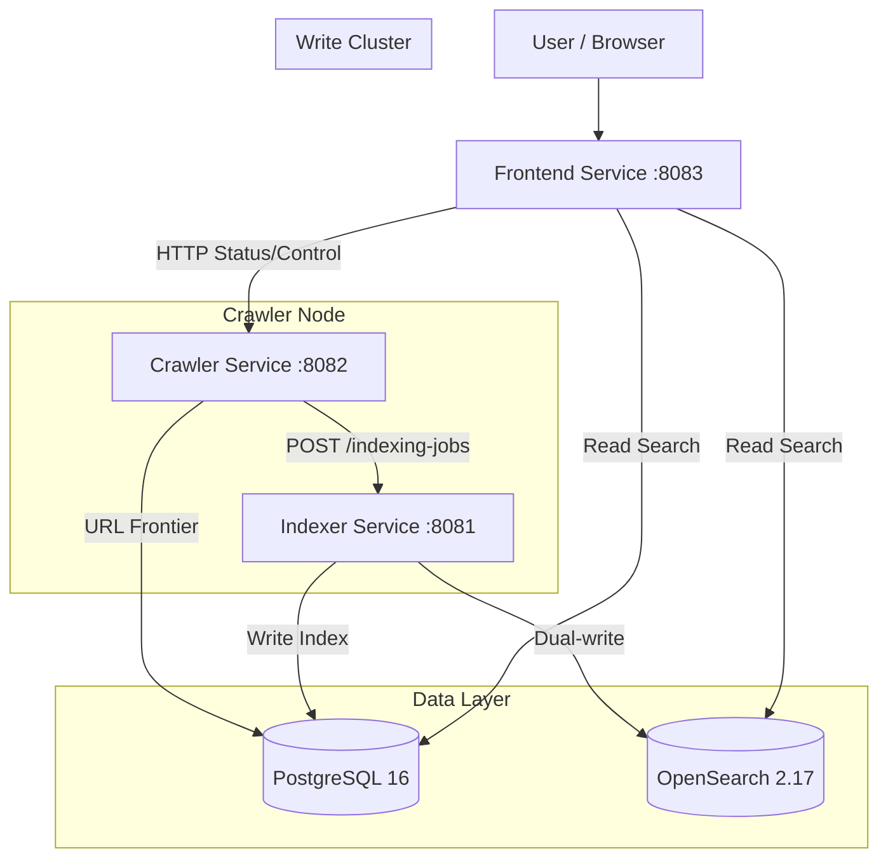

# Architecture Overview

## Status

Current runtime reference.

## Related Docs

- [Documentation Guide](./README.md)
- [Search Ranking Policy](./search-ranking-policy.md)
- [Search Evaluation](./search-evaluation.md)
- [Setup Guide](./setup.md)
- [Deployment Guide](./deployment.md)

The `web-search` project follows a **Service-Based Architecture** designed for clear separation of concerns, scalability, and independent deployment of Read/Write workloads (CQRS-lite).

## High-Level Design

The system consists of three independent services managed in a monorepo:

1.  **Frontend Service (Search Cluster)**:
    -   **Role**: UI and Search API (Read-Only).
    -   **Stack**: FastAPI + Jinja2 + PostgreSQL.
    -   **Port**: `8083`.
    -   **Scaling**: Can scale horizontally; shared DB in production.
    -   **Dependencies**: Depends on `web_search_contracts`, `web_search_core`, `web_search_search_config`, `web_search_postgres`, `web_search_kernel`, and `web_search_opensearch` for runtime policy, contracts, storage, and search access.
2.  **Indexer Service (Write Cluster)**:
    -   **Role**: Ingestion, Tokenization (Japanese via SudachiPy), document signal computation, and dual-write to OpenSearch.
    -   **Stack**: FastAPI + PostgreSQL + SudachiPy + OpenSearch (optional).
    -   **Port**: `8081`.
    -   **Scaling**: Write-heavy service; decoupled from read load.
    -   **Async Worker**: Background job processor for tokenization and OpenSearch sync. Optional embeddings are handled only by the explicit backfill job.
3.  **Crawler Service (Worker Node)**:
    -   **Role**: URL admission, durable frontier/domain scheduling state, parallel fetching, content extraction, link discovery.
    -   **Stack**: FastAPI + PostgreSQL + aiohttp + trafilatura (BS4 fallback).
    -   **Port**: `8082`.
    -   **Communication**: Sends pages to Indexer via HTTP API.

## Directory Structure

The project uses a **Folder-Separated Monorepo** pattern:

| Directory | Package Name | Purpose | Key Components |
| :--- | :--- | :--- | :--- |
| `apps/frontend/` | `web_search_frontend` | **Search Cluster**. UI & Search Logic. | `api/routers/search_api.py`, `services/search.py` |
| `apps/indexer/` | `web_search_indexer` | **Write Cluster**. Indexing & Optional Enrichment. | `api/routes/indexer.py`, `services/indexer.py`, `worker.py` |
| `apps/crawler/` | `web_search_crawler` | **Worker Node**. Fetching & URL Management. | `workers/pipeline.py`, `db/crawler_runtime_store.py`, `db/url_domain_state.py`, `frontier_planner.py` |
| `packages/contracts/` | `web_search_contracts` | **Contracts**. Typed APIs shared across services. | `indexer_api.py`, `enums.py` |
| `packages/core/` | `web_search_core` | **Core Runtime**. Shared config, logging, retry, and utility helpers. | `logging_config.py`, `retry.py`, `utils.py` |
| `packages/postgres/` | `web_search_postgres` | **Database Layer**. PostgreSQL connections, migrations, and repositories. | `search.py`, `migrate.py`, `repositories/document_repo.py` |
| `packages/kernel/` | `web_search_kernel` | **Search Kernel**. Analyzer, query parsing, snippets, and scoring helpers. | `analyzer.py`, `searcher.py`, `snippet.py` |
| `packages/opensearch/` | `web_search_opensearch` | **Retrieval Adapter**. OpenSearch client, mapping, and BM25 query builder. | `client.py`, `mapping.py`, `search.py` |
| `packages/indexing/` | `web_search_indexing` | **Experimental Enrichment Adapter**. OpenAI embedding client, schema bootstrap, and backfill image. | `embedding.py`, `backfill_embeddings.py` |
| `packages/search-config/` | `web_search_search_config` | **Search Policy Config**. Canonical-source and search-eval definitions. | `canonical_sources.py`, `search_eval.py`, `evaluator.py` |
| `db/alembic/` | - | **Database Migrations**. | `versions/001_initial_schema.py` |
| `docs/` | - | **Documentation**. | `architecture.md`, `setup.md`, `api.md` |
| `scripts/ops/` | - | **Operations**. | PageRank calculation, OpenSearch verify |

## Key Design Patterns

### 1. CQRS-lite (Separated Read/Write)
We separate the "Write" path (Indexer) from the "Read" path (Frontend).
*   **Indexer**: Heavy processing (Tokenization, OpenSearch sync, optional enrichment).
*   **Frontend**: Fast reads via PostgreSQL BM25 or OpenSearch.
*   Both services share the same PostgreSQL database.

### 2. URL Lifecycle (`urls` + `frontier_entries`)
The crawler stores discovered URL history in `urls` and active crawl candidates
in `frontier_entries`.

*   `urls`: discovered URLs, discovery route, and crawl history
*   `frontier_entries`: durable crawl queue state
*   `domain_state`: host-level pacing and inflight lease state

URL discovery and frontier admission are separate operations. A URL can be known
to the crawler without being scheduled as an active crawl candidate.

The runtime queue of record is `frontier_entries`.

### 3. Shared Packages
The old `shared` monolith has been split into smaller packages with clearer ownership:

*   **`packages/contracts/` (`web_search_contracts`)**: typed API payloads, enums, and read models shared across service boundaries.
*   **`packages/core/` (`web_search_core`)**: runtime utilities such as config loading, logging, retries, background helpers, and general-purpose utils.
*   **`packages/postgres/` (`web_search_postgres`)**: PostgreSQL connections, migrations, and repositories.
*   **`packages/kernel/` (`web_search_kernel`)**: analyzer, query parsing, snippets, and reusable search scoring helpers.
*   **`packages/opensearch/` (`web_search_opensearch`)**: OpenSearch client lifecycle, mappings, and BM25 retrieval helpers.
*   **`packages/indexing/` (`web_search_indexing`)**: experimental embedding-enrichment clients and schema bootstrap. It is not imported by baseline services.
*   **`packages/search-config/` (`web_search_search_config`)**: canonical-source manifests, search evaluation datasets, and evaluator logic.

### 4. Search Path
Frontend retrieves candidates from OpenSearch and applies a small source-aware
policy layer for selected query classes. Detailed ranking and signal behavior is
documented in [search-ranking-policy.md](./search-ranking-policy.md) and
[search-signals.md](./search-signals.md).

### 5. Data Flow
1.  **Crawl**: Crawler fetches HTML, extracts main content via trafilatura, extracts links/`published_at`, sends to Indexer via HTTP API.
2.  **Index**: Indexer tokenizes text (SudachiPy), computes document signals (factual density, temporal anchor, authorship clarity, information origin), writes to PostgreSQL + OpenSearch. Optional embeddings are a separate backfill lane.
3.  **Search**: Frontend queries OpenSearch with BM25, then applies a small canonical-source policy when the query is navigational/reference/news-like.
