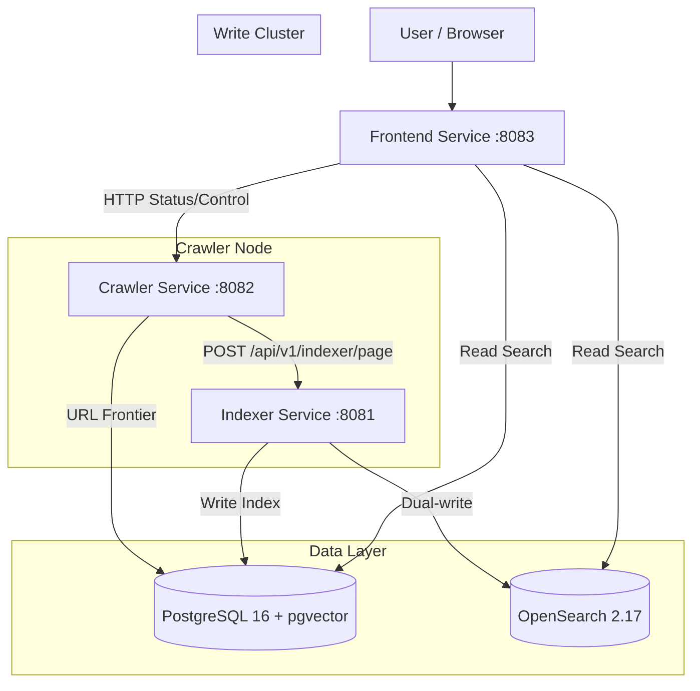

# Architecture Overview

The `web-search` project follows a **Service-Based Architecture** designed for clear separation of concerns, scalability, and independent deployment of Read/Write workloads (CQRS-lite).

## High-Level Design

The system consists of three independent services managed in a monorepo:

1.  **Frontend Service (Search Cluster)**:
    -   **Role**: UI, Search API (Read-Only), Admin Dashboard (Crawler Control, Analytics, API Keys).
    -   **Stack**: FastAPI + Jinja2 + PostgreSQL.
    -   **Port**: `8083`.
    -   **Scaling**: Can scale horizontally; shared DB in production.
    -   **Dependencies**: Depends on `shared` for DB models, search kernel, analyzer.
2.  **Indexer Service (Write Cluster)**:
    -   **Role**: Ingestion, Tokenization (Japanese via SudachiPy), Embedding (OpenAI), Dual-write to OpenSearch.
    -   **Stack**: FastAPI + PostgreSQL + SudachiPy + OpenSearch (optional).
    -   **Port**: `8081`.
    -   **Scaling**: Write-heavy service; decoupled from read load.
    -   **Async Worker**: Background job processor for tokenization and embedding generation.
3.  **Crawler Service (Worker Node)**:
    -   **Role**: URL frontier management, parallel fetching, content extraction, link discovery.
    -   **Stack**: FastAPI + PostgreSQL + aiohttp + trafilatura (BS4 fallback).
    -   **Port**: `8082`.
    -   **Communication**: Sends pages to Indexer via HTTP API.

## Directory Structure

The project uses a **Folder-Separated Monorepo** pattern:

| Directory | Package Name | Purpose | Key Components |
| :--- | :--- | :--- | :--- |
| `frontend/` | `frontend` | **Search Cluster**. UI & Search Logic. | `api/routers/search_api.py`, `services/search.py` |
| `indexer/` | `app` | **Write Cluster**. Indexing & Embedding. | `api/routes/indexer.py`, `services/indexer.py`, `worker.py` |
| `crawler/` | `app` | **Worker Node**. Fetching & URL Management. | `workers/pipeline.py`, `db/url_store.py`, `scheduler.py` |
| `shared/` | `shared` | **Shared Kernel**. Domain Logic & Infra. | `postgres/search.py`, `search_kernel/analyzer.py`, `search_kernel/searcher.py` |
| `db/alembic/` | - | **Database Migrations**. | `versions/001_initial_schema.py` ... `versions/009_add_information_origins.py` |
| `docs/` | - | **Documentation**. | `architecture.md`, `setup.md`, `api.md` |
| `scripts/ops/` | - | **Operations**. | PageRank calculation, seed import, OpenSearch verify |

## Key Design Patterns

### 1. CQRS-lite (Separated Read/Write)
We separate the "Write" path (Indexer) from the "Read" path (Frontend).
*   **Indexer**: Heavy processing (Tokenization, Embedding Generation, OpenSearch sync).
*   **Frontend**: Fast reads via PostgreSQL BM25 or OpenSearch.
*   Both services share the same PostgreSQL database.

### 2. URL Lifecycle (`urls` Ledger + `crawl_queue`)
The crawler keeps discovery state in `urls` and pending work in `crawl_queue`.

*   `urls`: all discovered URLs, with crawl history fields such as `last_crawled_at`
*   `crawl_queue`: URLs waiting to be processed

The current queue is intentionally simple: FIFO by `created_at`, plus scheduler-level
domain diversity and rate limiting. The old status/priority queue design has been
removed.

### 3. Shared Library (`shared/`)
*   **Database**: PostgreSQL 16 with pgvector extension. Connection pooling via `psycopg2.pool.ThreadedConnectionPool`.
*   **Search Engine (`shared.search_kernel`)**:
    *   **Hybrid Search**: Combines BM25 (Keyword) and Vector (Semantic) scores using Reciprocal Rank Fusion (RRF).
    *   **Tokenizer**: `SudachiPy` for Japanese morphological analysis.
    *   **Scoring**: BM25 + Information Origin + Factual Density + Temporal Anchor + Scope Match re-ranking + Claim Diversity.
    *   **Snippet Generation**: Context-aware snippet extraction with `<mark>` highlighting.
*   **OpenSearch Integration** (`shared.opensearch`): Optional dual-write for fast full-text search.

### 4. AI-Agent-Optimized Ranking Pipeline
The system uses a multi-signal ranking stack (see [content-quality.md](./content-quality.md)):
1.  **Extraction**: trafilatura strips boilerplate, extracts author/organization metadata. BS4 fallback for edge cases.
2.  **Signal Scoring**: Indexer computes per-document signals — `factual_density`, `temporal_anchor`, `authorship_clarity`, `information_origin`.
3.  **Retrieval**: OpenSearch `function_score` combines BM25 with `origin_score`, `factual_density`, and `temporal_anchor`.
4.  **Re-ranking**: Scope Match adjusts scores by query intent × document type affinity. Claim Diversity clusters results by content similarity.

### 5. Data Flow
1.  **Crawl**: Crawler fetches HTML, extracts main content via trafilatura, extracts links/`published_at`, sends to Indexer via HTTP API.
2.  **Index**: Indexer tokenizes text (SudachiPy), computes ranking signals (factual density, temporal anchor, authorship clarity), generates embeddings (OpenAI), writes to PostgreSQL + OpenSearch.
3.  **Search**: Frontend queries PostgreSQL (BM25) or OpenSearch, applies information origin + factual density + temporal anchor scoring, scope match re-ranking, and claim diversity clustering.
