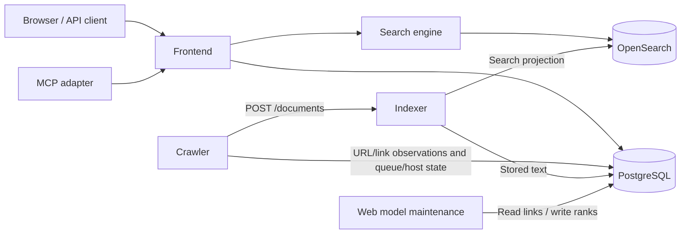

# Runtime boundaries

This document records ownership and consistency constraints that matter when
changing the system. Service configuration lives in `docker-compose.yml`.

## Responsibilities

| Component | Owns |
|---|---|
| Frontend | Public HTML/API, request validation, serialization, telemetry, and runtime wiring |
| Search engine package | Query preparation, OpenSearch retrieval, and candidate ranking |
| Crawler | Queue admission/dispatch, host pacing, HTTP fetches, extraction, and observed links |
| Indexer | Stored documents and their OpenSearch projection |
| Web model | Known URLs, observed links, and graph-derived rank maintenance |
| MCP adapter | Search/content tools that call the public API |

The frontend and indexer share PostgreSQL. Separating services does not give
them separate databases or transactions. The frontend reads stored content and
writes search telemetry, so “read service” does not mean it performs no writes.

The search engine is a code boundary inside the frontend deployment, not a
separate network service. It has no dependency on HTTP, PostgreSQL, cookies, or
Prometheus. The host supplies its OpenSearch client and handles retrieval
exceptions. `packages/search/README.md` records the interface and dependency
contract to preserve when adding retrieval methods.

The public read path and private ingestion path remain separate. There is no
admin UI. The frontend's crawler HTTP call is a health observation, not a
control API.

## Data flow and consistency

```mermaid
flowchart LR
    Browser[Browser / API client] --> Frontend
    MCP[MCP adapter] --> Frontend
    Frontend --> Search[Search engine]
    Search --> OS[(OpenSearch)]
    Frontend --> PG[(PostgreSQL)]
    Crawler -->|POST /documents| Indexer
    Crawler -->|URL/link observations and queue/host state| PG
    Indexer -->|Stored text| PG
    Indexer -->|Search projection| OS
    Maintenance[Web model maintenance] -->|Read links / write ranks| PG
```

PostgreSQL holds full extracted content. OpenSearch holds analyzed search
fields and a bounded content copy. The projection can be rebuilt from stored
documents and rank tables; the two stores are not an atomic dual write.

`POST /documents` writes PostgreSQL and attempts OpenSearch indexing within
the request. There is no current indexer job queue or background indexing
worker. The single-document path can return success after an OpenSearch failure.
The crawler's successful handoff therefore does not prove search visibility.
See `api.md` for observable failure behavior.

PageRank and domain-rank maintenance update PostgreSQL rank tables. Existing
OpenSearch documents keep their old values until projected again. Rank
recalculation and search projection freshness are distinct states.

## URL knowledge and crawl state

- `urls` and `links` represent known URLs and observed references, including
  targets that have not been indexed.
- `crawl_queue` holds pending work. A task is atomically removed when popped,
  before the HTTP fetch; there is no persisted in-progress lease.
- `domain_state` holds host pacing and backoff. The former persisted inflight
  lease counter has been removed.

Registering a URL does not inherently schedule a fetch. Crawler admission
decides which known URLs become queued targets. A crash after a pop can lose
that pending attempt; recording the result updates domain state and logs, not
a durable per-URL recrawl schedule. The old `crawl_schedule` table is removed.
`crawler-concepts.md` explains dispatch and handoff semantics.

## Operational implications

Search requires a reachable, populated OpenSearch index even though the Compose
search profile and `OPENSEARCH_ENABLED` flag can disable it. Readiness currently
gates on PostgreSQL only. Successful startup or HTTP 200 from readiness is not
a substitute for checking search.

Deployment identity, projection rebuilds, and physical-index changes are
covered in `deployment.md`; a healthy process alone does not establish that its
search data is current.
