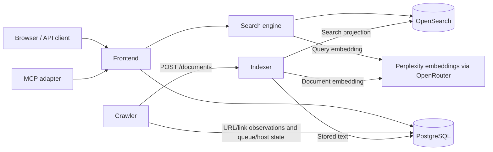

# Runtime boundaries

This document records ownership and consistency constraints that matter when
changing the system. Service configuration lives in `docker-compose.yml`.

## Responsibilities

| Component | Owns |
|---|---|
| Frontend | Public HTML/API, request validation, serialization, telemetry, and runtime wiring |
| Search engine package | Query preparation and native OpenSearch hybrid retrieval |
| Crawler | Queue admission/dispatch, host pacing, HTTP fetches, extraction, and observed links |
| Indexer | Stored documents, embeddings, and their OpenSearch projection |
| Web model | Known URLs and observed links |
| MCP adapter | Search/content tools that call the public API |

The frontend and indexer share PostgreSQL. Separating services does not give
them separate databases or transactions. The frontend reads stored content and
writes search telemetry, so “read service” does not mean it performs no writes.

The search engine is a code boundary inside the frontend deployment, not a
separate network service. It has no dependency on HTTP, PostgreSQL, cookies, or
Prometheus. The host supplies its OpenSearch client and query embedding function, and
handles retrieval exceptions. `packages/search/README.md` records the interface and dependency
contract to preserve when adding retrieval methods.

The public read path and private ingestion path remain separate. There is no
admin UI. Search readiness does not depend on crawler availability.

## Data flow and consistency

```mermaid
flowchart LR
    Browser[Browser / API client] --> Frontend
    MCP[MCP adapter] --> Frontend
    Frontend --> Search[Search engine]
    Search --> OS[(OpenSearch)]
    Search -->|Query embedding| Embeddings[Perplexity embeddings via OpenRouter]
    Indexer -->|Document embedding| Embeddings
    Frontend --> PG[(PostgreSQL)]
    Crawler -->|POST /documents| Indexer
    Crawler -->|URL/link observations and queue/host state| PG
    Indexer -->|Stored text| PG
    Indexer -->|Search projection| OS
```

PostgreSQL holds full extracted content. OpenSearch holds analyzed search
fields, a bounded content copy, and a 1,024-dimensional embedding. The projection
can be rebuilt from stored documents; the two stores are not an atomic dual write.

`POST /documents` commits PostgreSQL and generates the embedding and OpenSearch
projection within the request. Projection failure returns an error after the
stored document has committed, allowing the caller to retry. Excluded or empty
pages are stored but omitted from search. OpenSearch refresh still determines
when an accepted projection becomes visible. There is no background indexing queue.

OpenSearch combines BM25 and k-NN with its native RRF search pipeline. The
application preserves that order; canonical-source and graph-rank overrides
are not used. The default Compose stack no longer runs rank maintenance.

## URL knowledge and crawl state

- `urls` records known URLs, including targets that have not been indexed.
- R2 holds observed references; `link_outbox` temporarily holds pending uploads.
- `crawl_queue` holds pending work. A task is atomically removed when popped,
  before the HTTP fetch; there is no persisted in-progress lease.
- `domain_state` holds host pacing and backoff. The former persisted inflight
  lease counter has been removed.

Registering a URL does not inherently schedule a fetch. Crawler admission
decides which known URLs become queued targets. A crash after a pop can lose
that pending attempt; recording the result updates domain state and logs, not
a durable per-URL recrawl schedule. The old `crawl_schedule` table is removed.
`crawler-concepts.md` explains dispatch and handoff semantics.

The crawler records each page's outgoing links, URL discoveries, and referring
hosts in one PostgreSQL transaction. The archive worker sends JSONL+gzip batches
at 5,000 pages, 16 MiB, or five minutes. It verifies the payload and commit marker
before removing those exact outbox rows; retries reuse the same batch identity.
The bounded outbox pauses crawling when uploads cannot keep up.

Daily Parquet+Zstd snapshots use 256 URL hash partitions and retain each page's
highest revision, including empty link lists. Archive readers combine the snapshot
with subsequent committed batches. PostgreSQL advisory locks protect active reads
and uploads from collection, which keeps two snapshots and a 24-hour grace period.
The frozen `legacy_links` table is only an export source during initial migration.

## Operational implications

Search requires PostgreSQL, the current hybrid index and RRF pipeline, and an
embedding API key. Readiness checks those local requirements. It does not make a
paid embedding request, so it cannot establish provider availability or quota.
Search dependency failures return HTTP 503. A populated index and a successful
search are still necessary to establish useful service behavior.

Deployment identity, projection rebuilds, and physical-index changes are
covered in `deployment.md`; a healthy process alone does not establish that its
search data is current.
